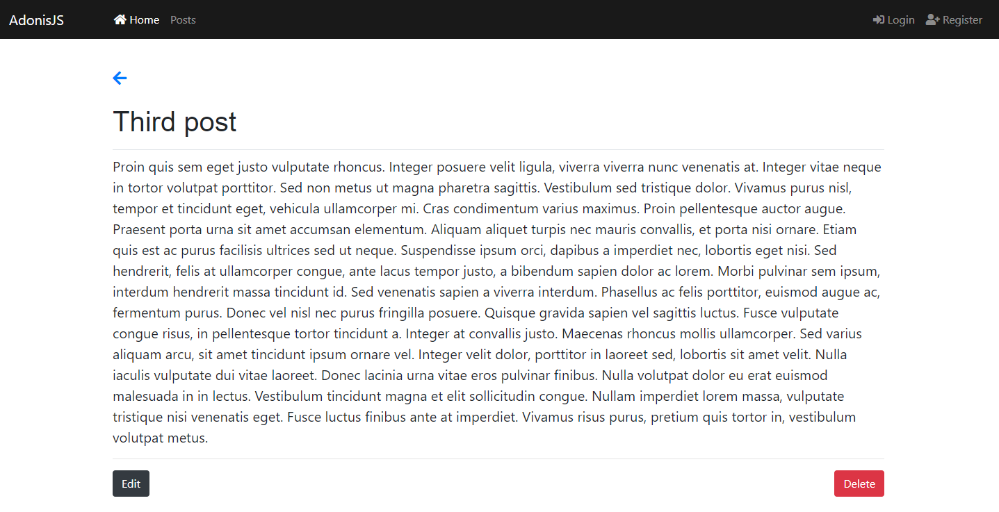

# Adonis Fullstack Application

Simple Blog fullstack CRUD application using Adonis for the purposes of learning the framework.

## Setup

Use the adonis command to install the blueprint

```bash
adonis new yardstick
```

or manually clone the repo and then run `npm install`.


### Migrations

Run the following command to run startup migrations.

```js
adonis migration:run
```

### Sample Image


